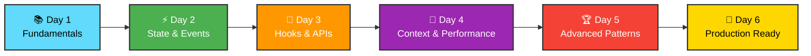
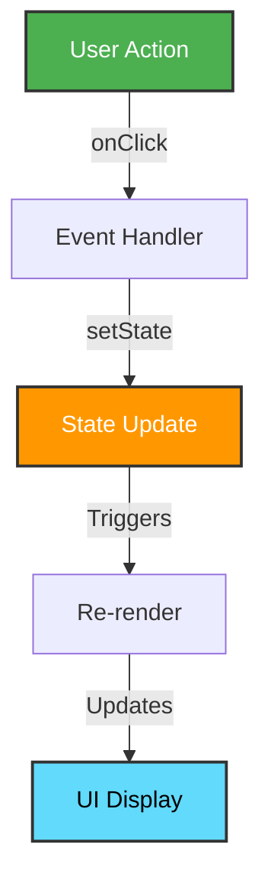
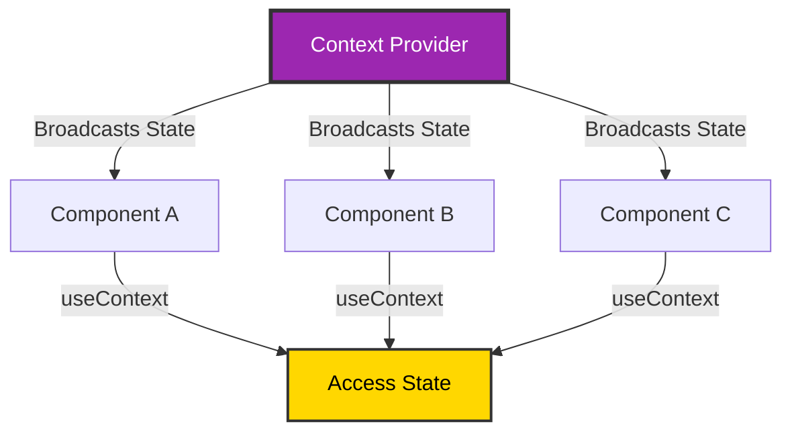
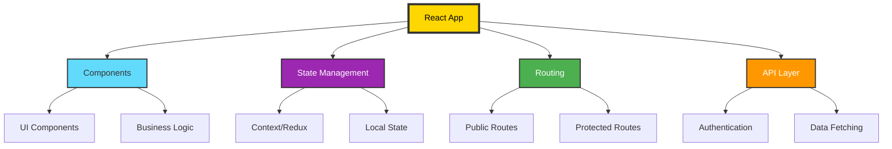
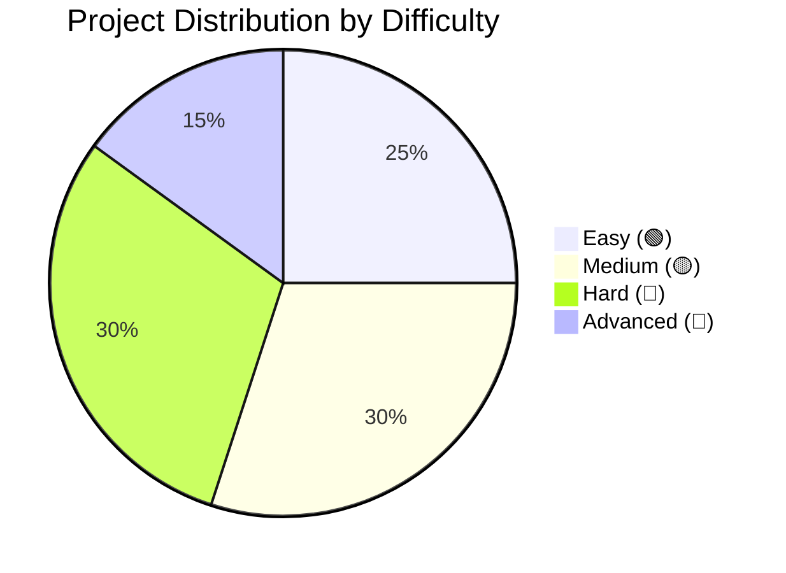

# 🚀 React.js: Zero to Hero in 6 Days

**Master React.js from Beginner to Professional in Just 6 Days! 💪**

[Getting Started](#-getting-started) • [Roadmap](#-learning-roadmap) • [Projects](#-projects) • [Resources](#-resources)

---

## 📋 Table of Contents

- [Overview](#-overview)
- [Learning Roadmap](#-learning-roadmap)
  - [Day 1: React Fundamentals](#day-1--react-fundamentals--jsx)
  - [Day 2: State Management](#day-2--state-management--event-handling)
  - [Day 3: Advanced Hooks](#day-3--advanced-hooks--side-effects)
  - [Day 4: Context API](#day-4--context-api--performance-optimization)
  - [Day 5: Advanced Patterns](#day-5--advanced-patterns--mastery)
  - [Day 6: Real-World Apps](#day-6--real-world-application--best-practices)
- [Projects Overview](#-projects)
- [Learning Tips](#-learning-tips)

---

## 🎯 Overview

This comprehensive roadmap takes you from **complete beginner** to **React master** in just 6 intensive days. Each day builds upon the previous, with hands-on projects and real-world analogies to solidify your understanding.

---

## 📚 Learning Roadmap

### Day 1: 🧱 React Fundamentals & JSX

<b>Click to expand Day 1 curriculum</b>

#### 📖 Topics Covered
- ✅ JSX syntax and expressions
- ✅ Components (Functional Components)
- ✅ Props and component composition
- ✅ Basic styling in React

#### 💡 Real-Life Analogy
> **LEGO Blocks Concept** 🧩
> 
> Think of React components like LEGO blocks. Each block (component) is a reusable piece that you can combine with other blocks to build something larger. Props are like the instructions that tell each block how to look and behave.

#### 🎯 Projects

| Difficulty | Project | Skills Practiced |
|------------|---------|------------------|
| 🟢 Easy | Personal Profile Card | JSX, Props, Basic Styling |
| 🟡 Medium | Product Card Gallery | Component Reusability, Props |
| 🔴 Hard | Movie List Component | Nested Components, Prop Drilling |

---

### Day 2: ⚡ State Management & Event Handling

<b>Click to expand Day 2 curriculum</b>

#### 📖 Topics Covered
- ✅ useState hook fundamentals
- ✅ Event handling (onClick, onChange, onSubmit)
- ✅ Conditional rendering
- ✅ Lists and keys in React

#### 💡 Real-Life Analogy
> **Smart Notebook Concept** 📓
> 
> State is like a notebook where React keeps track of changing information. When you update the notebook (setState), React automatically re-renders the page to show the new information - like a smartboard that updates itself when you write on it.

#### 🎯 Projects

| Difficulty | Project | Skills Practiced |
|------------|---------|------------------|
| 🟢 Easy | Counter App | useState, Event Handlers |
| 🟡 Medium | Todo List Application | CRUD Operations, State Updates |
| 🔴 Hard | Quiz Application | Complex State, Score Tracking |

---

### Day 3: 🔄 Advanced Hooks & Side Effects

<b>Click to expand Day 3 curriculum</b>

#### 📖 Topics Covered
- ✅ useEffect hook and lifecycle
- ✅ Data fetching from APIs
- ✅ React Router basics (navigation, dynamic routes)
- ✅ Custom hooks creation
- ✅ Forms and controlled components

#### 💡 Real-Life Analogy
> **Personal Assistant Concept** 🤖
> 
> useEffect is like a personal assistant that watches for specific changes and takes action. For example, when you open your fridge (component mounts), the light turns on automatically (effect runs). When you close it, the light turns off (cleanup).

#### 🎯 Projects

| Difficulty | Project | Skills Practiced |
|------------|---------|------------------|
| 🟢 Easy | Weather App | API Fetching, useEffect |
| 🟡 Medium | Multi-Page Blog with Routing | React Router, Navigation |
| 🔴 Hard | Recipe Finder with Search | API Integration, Dynamic Routing |

---

### Day 4: 🎨 Context API & Performance Optimization

<b>Click to expand Day 4 curriculum</b>

#### 📖 Topics Covered
- ✅ Context API and useContext hook
- ✅ useReducer for complex state
- ✅ React.memo and useMemo
- ✅ useCallback hook
- ✅ Lazy loading and code splitting
- ✅ Error boundaries

#### 💡 Real-Life Analogy
> **Radio Broadcast Tower** 📡
> 
> Context API is like a radio broadcast tower. Instead of passing messages person-to-person (prop drilling), the tower broadcasts to everyone who has a radio (any component can listen).
>
> **Vending Machine** 🏪
>
> useReducer is like a vending machine - you give it specific commands (actions), and it processes them according to built-in rules (reducer function).

#### 🎯 Projects

| Difficulty | Project | Skills Practiced |
|------------|---------|------------------|
| 🟢 Easy | Theme Switcher App | Context API, useContext |
| 🟡 Medium | Shopping Cart System | Context, useReducer |
| 🔴 Hard | Task Management Dashboard | Multiple Contexts, Optimization |

---

### Day 5: 🏆 Advanced Patterns & Mastery

<b>Click to expand Day 5 curriculum</b>

#### 📖 Topics Covered
- ✅ Higher Order Components (HOCs)
- ✅ Render props pattern
- ✅ Compound components
- ✅ Controlled vs uncontrolled components
- ✅ Custom hooks library
- ✅ Testing with Jest and React Testing Library
- ✅ TypeScript with React basics

#### 💡 Real-Life Analogy
> **Gift Wrapper Concept** 🎁
> 
> HOCs are like gift wrappers. You give them a component (gift), and they wrap it with additional functionality (wrapping paper, ribbon) without changing what's inside.
>
> **Restaurant Menu System** 🍽️
>
> Compound components are like a restaurant menu system - the Menu component and MenuItem components work together as a family, sharing internal state.

#### 🎯 Projects

| Difficulty | Project | Skills Practiced |
|------------|---------|------------------|
| 🟡 Medium | Reusable Form Library | Custom Hooks, Validation |
| 🔴 Hard | Data Table with Sorting/Filtering | HOCs, Performance |
| 🔴 Advanced | E-commerce Frontend | Complete App, Authentication |

---

### Day 6: 🚀 Real-World Application & Best Practices

<b>Click to expand Day 6 curriculum</b>

#### 📖 Topics Covered
- ✅ Project architecture and folder structure
- ✅ State management libraries (Redux Toolkit or Zustand overview)
- ✅ API integration patterns
- ✅ Authentication and protected routes
- ✅ Deployment (Vercel/Netlify)
- ✅ Performance monitoring and debugging
- ✅ Next.js basics (optional)

#### 💡 Real-Life Analogy
> **House Construction** 🏗️
> 
> Building a React app is like constructing a house. Day 1-5 taught you individual skills (plumbing, electrical, carpentry). Day 6 is about bringing it all together with proper architecture, making sure everything works together efficiently, and ensuring the house is ready for people to live in (deployment).

#### 🎯 Capstone Projects

| Difficulty | Project | Skills Practiced |
|------------|---------|------------------|
| 🟡 Medium | Personal Portfolio Website | Routing, Animations, Forms |
| 🔴 Hard | Social Media Dashboard | Real-time Updates, Auth |
| 🔴 Advanced | Full-Stack Blog Platform | CRUD, Production Deployment |

---

## 🎮 Projects

### Difficulty Breakdown

### 📌 Best Practices

1. **📚 Complete Projects First**
   - Don't move to the next day until all projects are done
   - Each project reinforces the concepts learned

2. **📖 Use Official Docs**
   - Refer to [React Documentation](https://react.dev) for deeper understanding
   - Bookmark important sections

3. **🔧 Essential Tools**
   - Install React DevTools browser extension
   - Use VS Code with React snippets
   - Set up ESLint and Prettier

4. **👥 Community Support**
   - Join React communities (Discord, Reddit)
   - Share your code for reviews
   - Help others to reinforce your learning

5. **🎯 Focus Areas**
   - By Day 5, you'll have mastered React patterns
   - Ready for professional development by Day 6
   - Build a portfolio of 18+ projects

---

## 🎓 Resources

### 📚 Official Documentation
- [React Official Docs](https://react.dev)
- [React Roadmap](https://roadmap.sh/react)

### 🛠️ Development Tools
- React DevTools
- VS Code
- Create React App / Vite

### 🌐 Community
- [React Discord](https://discord.gg/react)
- [r/reactjs](https://reddit.com/r/reactjs)
- Stack Overflow

---

## 🏆 Certification

After completing this roadmap, you will have:

✅ Built 18+ real-world projects  
✅ Mastered React fundamentals and advanced patterns  
✅ Understanding of state management solutions  
✅ Production-ready development skills  
✅ A portfolio to showcase to employers  

---

### 🌟 Ready to Start Your React Journey?

**Begin with Day 1 and commit to the process!**

Made with ❤️ for aspiring React developers

